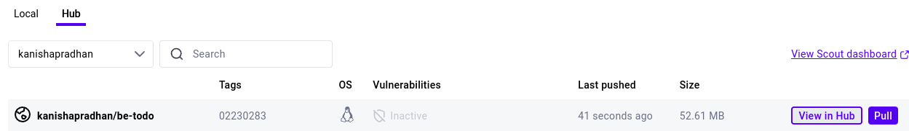
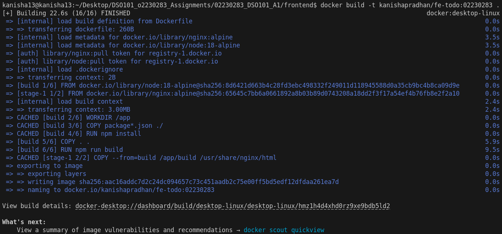
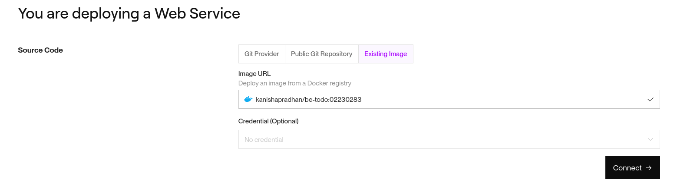
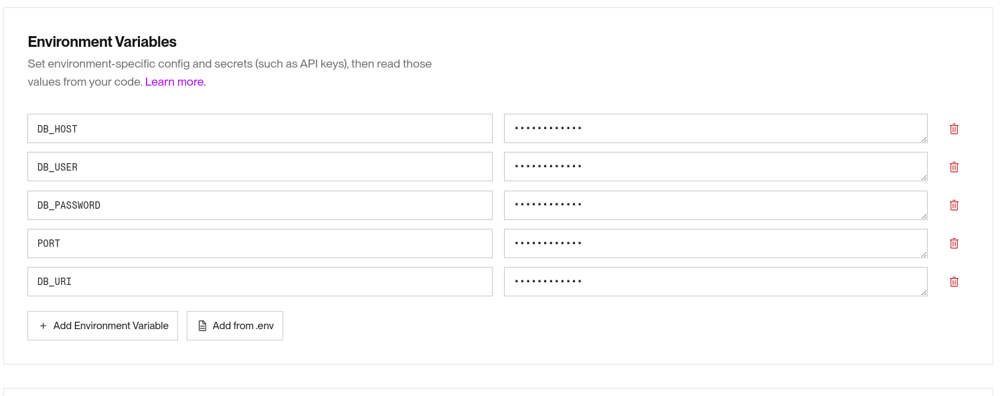
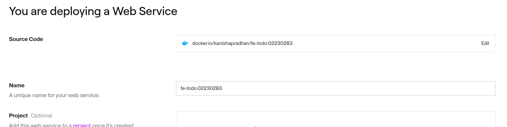
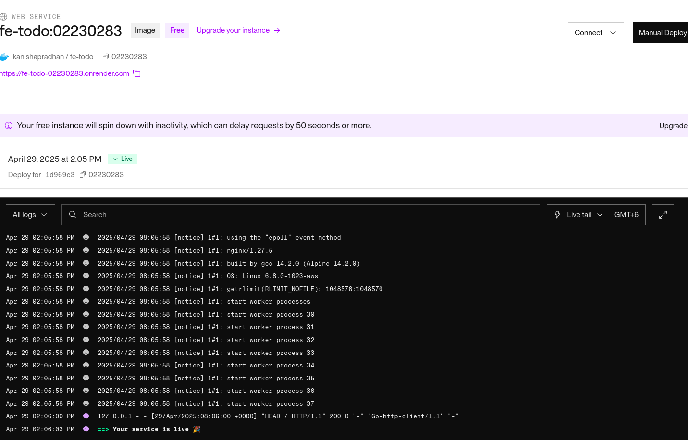

# Todo List Application with CI/CD Integration

## Repository Structure

DSO101_Assignments/
├── render.yaml (moved to root for deployment)
└── 02230283_DSO101_A1/
    ├── frontend/
    │   ├── src/
    │   │   ├── App.js
    │   │   └── App.css
    │   ├── Dockerfile
    │   ├── package.json
    │   └── .env
    ├── backend/
    │   ├── server.js
    │   ├── package.json
    │   ├── Dockerfile
    │   └── .env
    └── README.md

## Step 0: Creating the Todo List Application

### Backend (Node.js + PostgreSQL)

- Created a Node.js Express server with REST API endpoints for Todo CRUD operations
- Set up PostgreSQL database connection using environment variables
- Implemented Sequelize ORM for database operations
- Created the Todo model with text and completed status

Key configurations:

- Environment variables for database connection
- API endpoints for adding/editing/deleting tasks
- Server configured to use port from environment variables

### Frontend (React)

- Created a React application with components for Todo management
- Implemented API service to communicate with the backend
- Added UI for viewing, adding, editing, and deleting tasks
- Used environment variables for backend API URL

Key configurations:

- Environment variables for API endpoint
- Component for displaying Todo items
- Form for adding new Todo items
- Edit and delete functionality

## Part A: Deploying Pre-built Docker Images
1. Building Docker Images

Created Dockerfiles for both frontend and backend

2. Building and Pushing Images to Docker Hub

3. Deploying on Render

- Created a PostgreSQL database in Render

Deployed backend as a Web Service:

- Selected "Existing image from Docker Hub"
- Used image: kanishapradhan/be-todo:02230283

- Set environment variables for database connection

Deployed frontend as a Web Service:

- Selected "Existing image from Docker Hub"
- Used image: kanishapradhan/fe-todo:02230283

- Set REACT_APP_API_URL to the backend URL

## Part B: Automated Build and Deployment

1. Creating render.yaml for Multi-service Deployment

Created render.yaml file with configurations for both frontend and backend services

2. Repository Structure Adjustments
Initially encountered issues with the render.yaml file location. Since the assignment was in a subfolder (02230283_DSO101_A1), we needed to:

- Move the render.yaml file to the repository root
- Update the paths in render.yaml to include the subfolder path

## Challenges and Solutions

1. Database Connection Issues

Initially attempted to use MongoDB but switched to PostgreSQL per assignment requirements. Created a local PostgreSQL database for development

2. Frontend/Backend Integration

Updated the frontend code to work with PostgreSQL's id field rather than MongoDB's _id

3. Deployment Challenges
When attempting to deploy using render.yaml, encountered issues with the Dockerfile path. The solution involved:

Moving render.yaml to the repository root
Updating paths to include the subfolder:

Changed ./backend/Dockerfile to 02230283_DSO101_A1/backend/Dockerfile
Changed ./frontend/Dockerfile to 02230283_DSO101_A1/frontend/Dockerfile

## Conclusion

Successfully implemented a Todo List application with CI/CD integration:

- Created a full-stack application with React frontend and Node.js backend
- Used environment variables for configuration
- Set up Docker containerization for both frontend and backend
- Deployed Docker images to Docker Hub
- Created a render.yaml configuration for automated deployment
- Implemented Blueprint deployment from the repository

The application demonstrates a complete CI/CD workflow where changes pushed to GitHub automatically trigger the build and deployment of updated Docker images on Render.com.
