# Todo List Application with CI/CD Integration

## Step 0: Creating the Todo List Application

### Backend (Node.js + PostgreSQL)

- Created a Node.js Express server with REST API endpoints for Todo CRUD operations
- Set up PostgreSQL database connection using environment variables
- Implemented Sequelize ORM for database operations
- Created the Todo model with text and completed status

Key configurations:

- Environment variables for database connection
- API endpoints for adding/editing/deleting tasks
- Server configured to use port from environment variables

### Frontend (React)

- Created a React application with components for Todo management
- Implemented API service to communicate with the backend
- Added UI for viewing, adding, editing, and deleting tasks
- Used environment variables for backend API URL

Key configurations:

- Environment variables for API endpoint
- Component for displaying Todo items
- Form for adding new Todo items
- Edit and delete functionality

## Part A: Deploying Pre-built Docker Images
1. Building Docker Images

Created Dockerfiles for both frontend and backend

2. Building and Pushing Images to Docker Hub

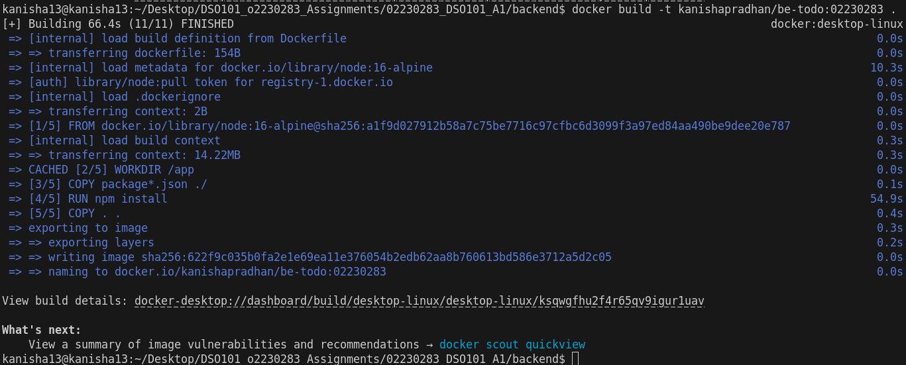


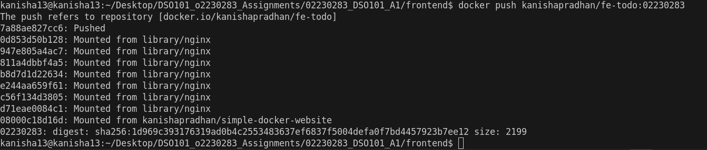


3. Deploying on Render

- Created a PostgreSQL database in Render

Deployed backend as a Web Service:

- Selected "Existing image from Docker Hub"
- Used image: kanishapradhan/be-todo:02230283


- Set environment variables for database connection


Deployed frontend as a Web Service:

- Selected "Existing image from Docker Hub"
- Used image: kanishapradhan/fe-todo:02230283


- Set REACT_APP_API_URL to the backend URL


## Part B: Automated Build and Deployment

1. Creating render.yaml for Multi-service Deployment

Created render.yaml file with configurations for both frontend and backend services

2. Repository Structure Adjustments
Initially encountered issues with the render.yaml file location. Since the assignment was in a subfolder (images), we needed to:

- Move the render.yaml file to the repository root
- Update the paths in render.yaml to include the subfolder path

## Challenges and Solutions

1. Database Connection Issues

Initially attempted to use MongoDB but switched to PostgreSQL per assignment requirements. Created a local PostgreSQL database for development

2. Frontend/Backend Integration

Updated the frontend code to work with PostgreSQL's id field rather than MongoDB's _id

3. Deployment Challenges
When attempting to deploy using render.yaml, encountered issues with the Dockerfile path. The solution involved:

- Moving render.yaml to the repository root
- Updating paths to include the subfolder:

Changed ./backend/Dockerfile to images/backend/Dockerfile

Changed ./frontend/Dockerfile to images/frontend/Dockerfile

## Conclusion

Successfully implemented a Todo List application with CI/CD integration:

- Created a full-stack application with React frontend and Node.js backend
- Used environment variables for configuration
- Set up Docker containerization for both frontend and backend
- Deployed Docker images to Docker Hub
- Created a render.yaml configuration for automated deployment
- Implemented Blueprint deployment from the repository

The application demonstrates a complete CI/CD workflow where changes pushed to GitHub automatically trigger the build and deployment of updated Docker images on Render.com.


# Assignment II: CI/CD Pipeline for Node.js Todo Application

This repository contains the implementation of a Jenkins CI/CD pipeline for automating the build, test, and deployment processes of a Node.js Todo application from Assignment 1.

## How the Pipeline Was Configured

1. Jenkins Setup

Installed Jenkins from jenkins.io/download and ran it on localhost:8080

Installed required plugins:

- NodeJS Plugin (for npm)
- Pipeline
- GitHub Integration
- Docker Pipeline

2. NodeJS Configuration in Jenkins

Navigated to Manage Jenkins > Tools > NodeJS

Added NodeJS installation (version 24.0.2)

Enabled automatic installation to ensure npm was properly detected

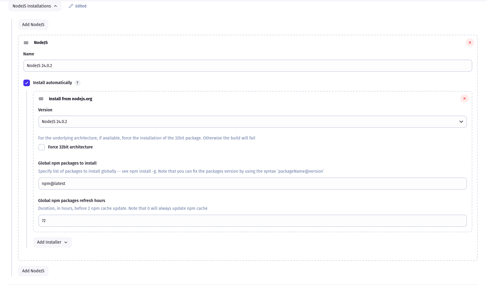


3. GitHub Repository Integration

Created a GitHub Personal Access Token (PAT) with repo and admin:repo_hook permissions

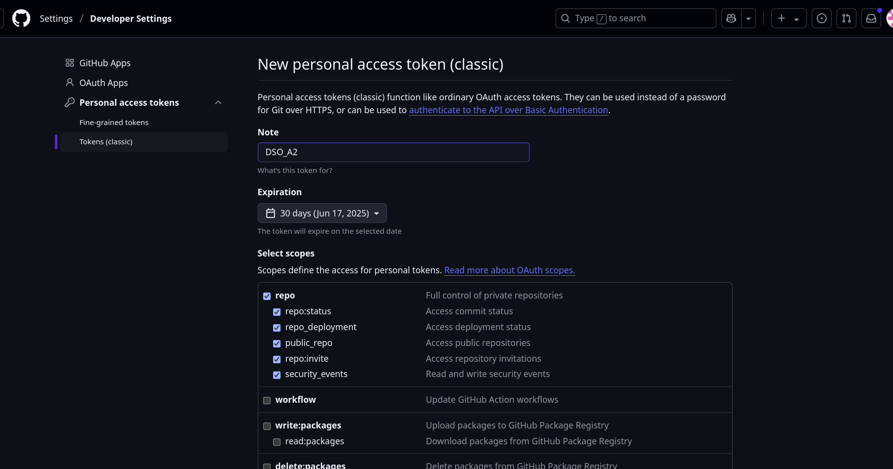


Added GitHub credentials in Jenkins (Manage Jenkins > Credentials > Add)

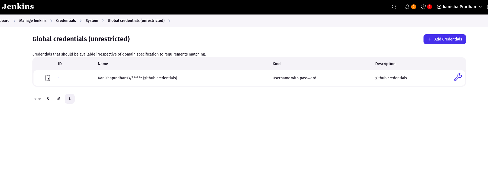


Connected the pipeline to the repository


4. Jenkinsfile Implementation

Created a Jenkinsfile in the repository root with the following stages:


5. Pipeline Execution

Created a new Jenkins Pipeline item

Configured it to use Pipeline script from SCM (Git)

Provided the repository URL and credentials

Set the script path to "Jenkinsfile"


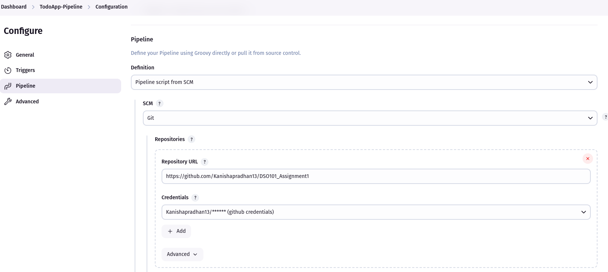


Built and monitored the pipeline execution

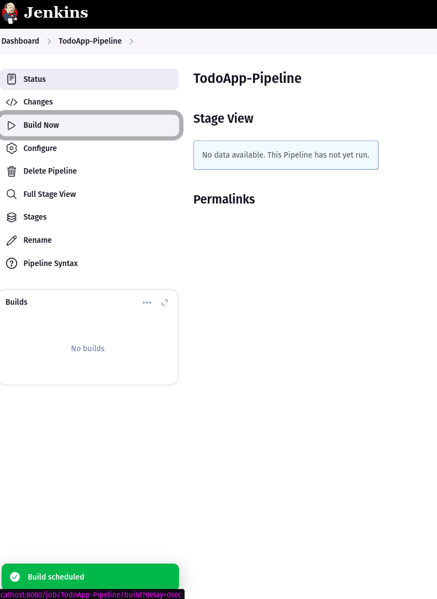

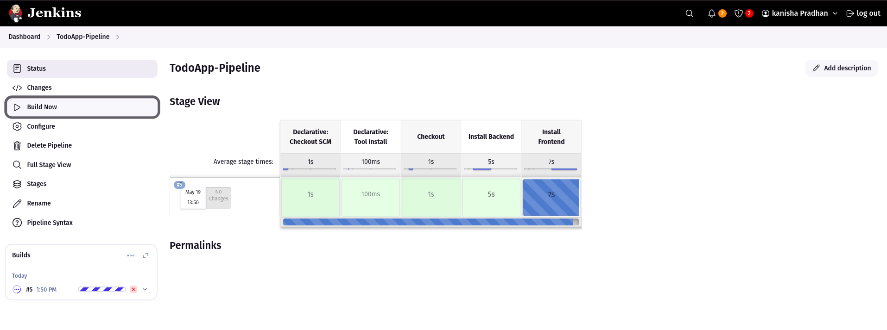

### Successful pipeline execution after 9 attempts 


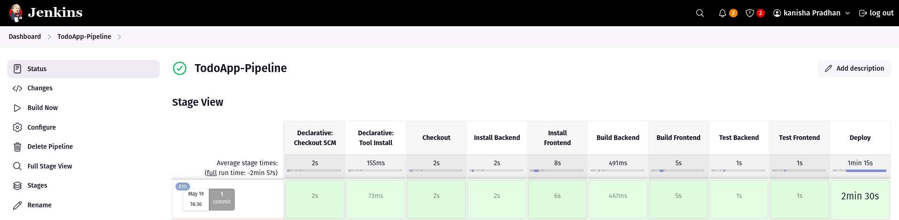

### DockerHub image 


image link : https://hub.docker.com/repository/docker/kanishapradhan/node-app/tags/latest/sha256-0032b490171f27f630435bf0f05713dc66a3b40692981b8c38d6a5b0f77b0eae

### GitHub repo link with Jenkinsfile 

https://github.com/Kanishapradhan13/DSO101_Assignment1-2-3

## Challenges Faced & Solutions

#### Challenge 1: NodeJS Tool Configuration

Problem: 
When setting up Jenkins, there was confusion about how to ensure npm was properly detected.

Solution:

Verified the NodeJS plugin was installed in Jenkins

Configured NodeJS in Manage Jenkins > Tools

Selected "Install automatically" to ensure npm was included

Named the tool 'NodeJS 24.0.2' to clearly identify the version


#### Challenge 2: Jenkinsfile Syntax Errors

Problem: 
Initial pipeline runs failed with the error "Invalid parameter 'Url', did you mean 'url'?" and "Tool type 'nodejs' does not have an install of 'NodeJS' configured."

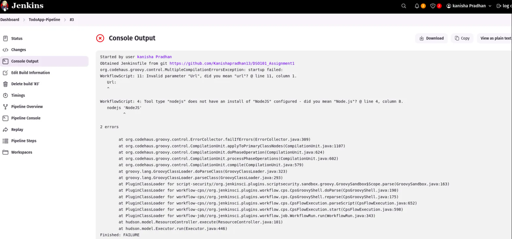

Solution:

Fixed the case sensitivity issue by changing Url: to url: for the git repository URL

Updated the NodeJS tool name in the Jenkinsfile to match exactly what was configured in Jenkins ('NodeJS 24.0.2')


#### Challenge 3: Package.json Not Found

Problem: 
The pipeline failed with "npm error code ENOENT" because it was trying to find package.json in the root directory, but the project had separate frontend and backend directories.

Solution:

Used the dir() step in the Jenkinsfile to change directories before running npm commands

Created separate stages for frontend and backend to install dependencies, build, and test both components independently

#### Challenge 4: React Build ESLint Errors

Problem: 
The frontend build failed due to ESLint warnings being treated as errors in the CI environment.


Solution:

Found the specific error in App.js about a missing React Hook dependency ('fetchTodos')

Modified the build step to continue even if there were ESLint warnings


#### Challenge 5: Docker Permission Issues

Problem: 
The deployment stage failed with "permission denied while trying to connect to the Docker daemon socket."


Solution:

Added the Jenkins user to the Docker group:

```sudo usermod -aG docker jenkins```

Restarted both Docker and Jenkins services:

```sudo systemctl restart docker```

```sudo systemctl restart jenkins```

#### Challenge 6: Missing Dockerfile at Root

Problem: 
The deployment stage failed with "failed to read dockerfile: open Dockerfile: no such file or directory."


Solution:

Identified that existing Dockerfiles were already present in both frontend and backend directories

Modified the Jenkinsfile to explicitly specify the path to the backend Dockerfile:


set up the Docker Hub credentials in Jenkins to push the image in dockerHub

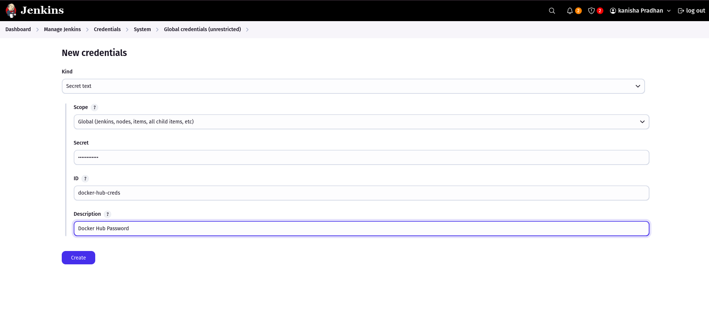

#### Challenge 7: Test Results Not Displaying

Problem: Despite configuring the post section correctly in the Jenkinsfile, test results weren't visible in the Jenkins interface.

This problem could not be solved so the Test Results cannot be viewed.

## Conclusion

This CI/CD pipeline demonstrates a complete automation workflow for a full-stack Node.js application, handling both frontend and backend components in a structured, reliable manner.


# Assignment III : CI/CD with GitHub Actions

This repository contains the implementation of a CI/CD pipeline using GitHub Actions for a Node.js Todo List application. The pipeline automates the building, testing, and deployment of both frontend (React) and backend (Node.js) components using Docker containers and   Render.com for cloud deployment.

## GitHub Actions Pipeline Implementation

### Repository Setup and Verification

1. Repository Structure Verification

Verified both directories had their respective package.json files with necessary scripts

Confirmed both directories contained proper Dockerfiles for containerization

Made sure the repository was set to public for easier GitHub Actions execution

### GitHub Actions Workflow Creation

Implemented Complete Workflow File

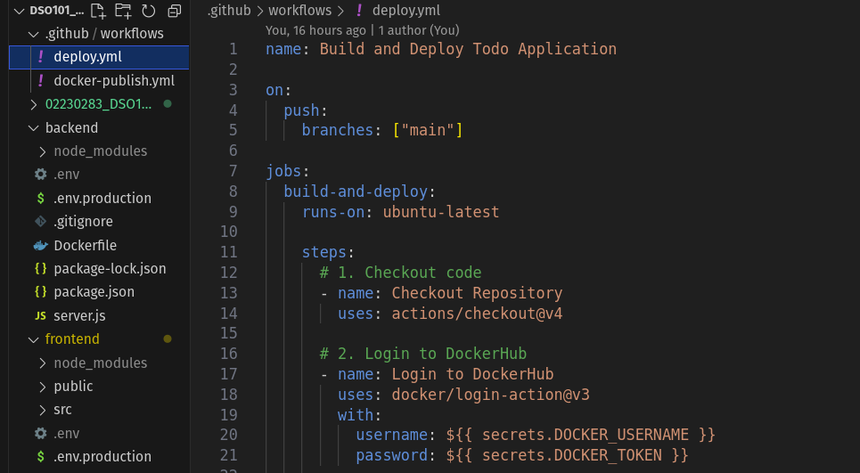

### GitHub Secrets Configuration

1. Added Required Secrets

DOCKERHUB_USERNAME: My DockerHub username

DOCKERHUB_TOKEN: Generated DockerHub access token from DockerHub account settings


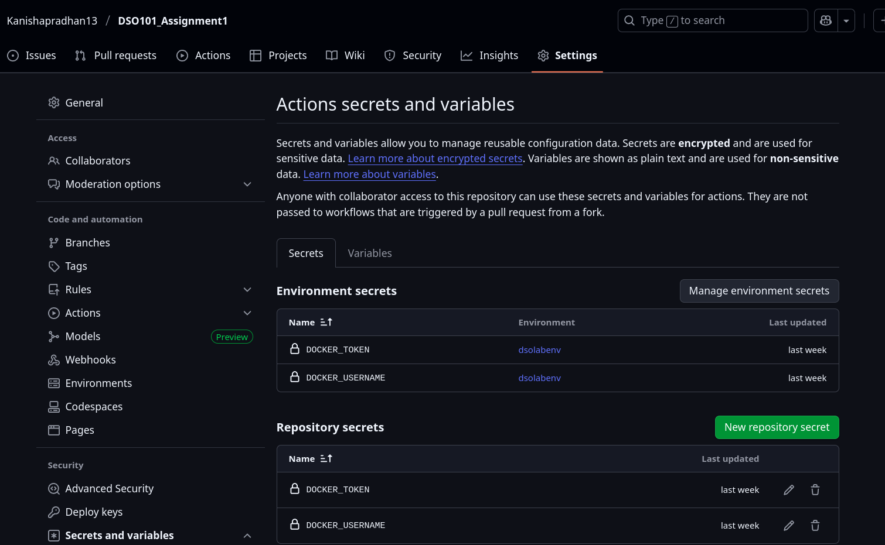

RENDER_BACKEND_WEBHOOK_URL: Webhook URL for frontend service deployment

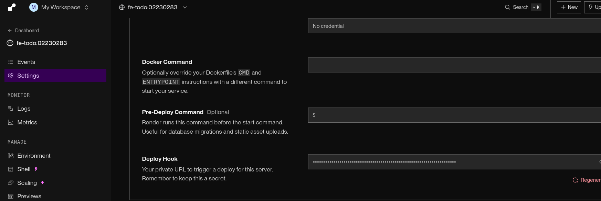

RENDER_FRONTEND_WEBHOOK_URL: Webhook URL for backend service deployment

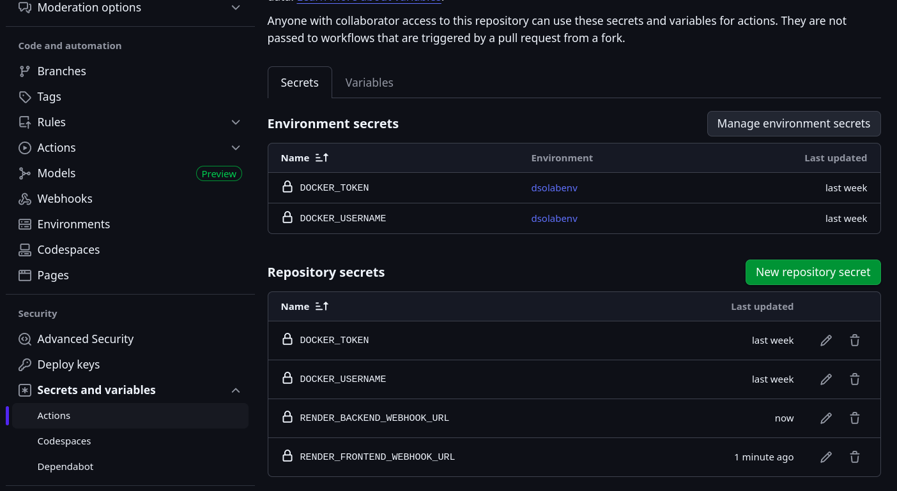

### Render.com Deployment Setup

The frontend and backend services were deployed in assignment 1 itself 

### Pipeline Testing and Validation

1. Initial Commit and Push

Committed all workflow files to repository

Pushed changes to main branch

Monitored GitHub Actions tab for workflow execution

Verified each step executed successfully


2. Deployment Verification

Confirmed Docker images appeared in DockerHub repository


## Challenges Faced & Solutions

Since a similar task for the build and push was completed in a class practical, I had previously encountered and resolved challenges related to:

- GitHub secrets configuration and management

the secrets were supposed to be added in the repository secrets and not the environment secrets. 

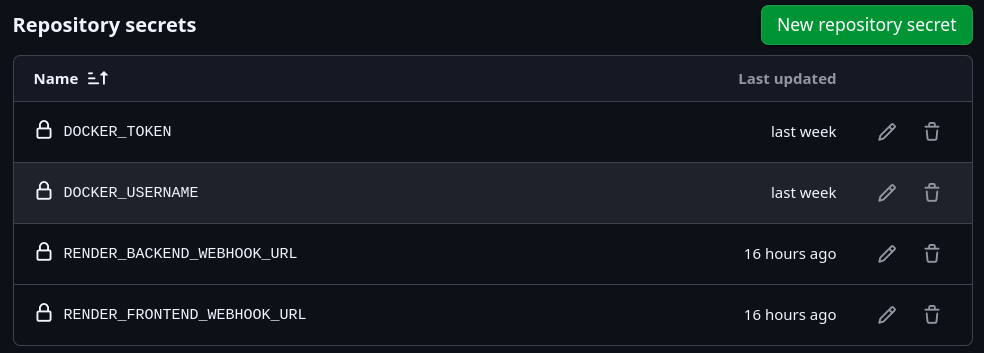

- DockerHub authentication and token generation

The token should be given read and write access

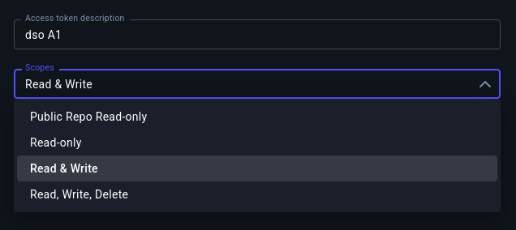

- Docker build context and file path specifications

This prior experience allowed me to implement the GitHub Actions workflow efficiently without encountering significant technical obstacles.

## Key Learnings and Outcomes

- GitHub Actions Mastery: Gained comprehensive understanding of YAML-based workflow configuration

- Multi-Container Orchestration: Learned to manage separate build processes for different application components

- Cloud Deployment Automation: Implemented end-to-end deployment automation using webhook integration

- Security Best Practices: Applied secure credential management using GitHub secrets

- DevOps Integration: Connected development workflow with production deployment seamlessly

#### link to render deployment instance : 

https://be-todo-02230283.onrender.com

https://fe-todo-02230283.onrender.com

#### GitHub Repo Link:

https://github.com/Kanishapradhan13/DSO101_Assignment1-2-3

## Conclusion 

This CI/CD implementation demonstrates a production-ready deployment pipeline that automates every aspect of the development-to-deployment workflow, ensuring consistent, reliable, and secure application delivery.